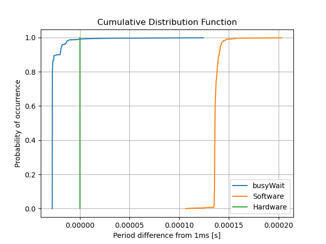
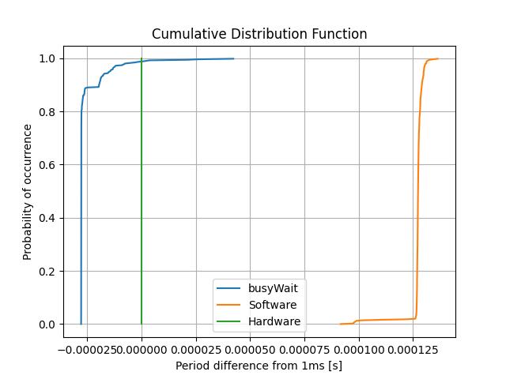

# 3. Common CDF Graphs

Pick either period or duty cycle for your analysis.
Reason for your metric choice.
Assess the differences
between the generated signals using each method in a qualitative and quantitative way.

We have decided to assess period because we have the difference on the X axis
- The software-based graphs, Software and busyWait, have periods that are off by small amounts, 1.137ms and 0.207ms respectfully. These graphs were visually warped and not uniform, reflecting the discrepency in the prediction and the actual.
- The hardware graph is more accurate and the data had no discrepencies in the period and it was predicted, yielding one uniform spike.
- We predict that the reason for these results is because the hardware timer was hardware-based and the Software and busyWait were both software-based.

Create one additional CDF to compare across the three methods of generating the PWM signal
for one mesaurment condition. Pick the condition that highlights the differences across methods the best.

- The condition that highlights the difference across the methods the best is the stress test. 

We have decided to assess the stress test to observe how the different PWMs handle stress being applied
- The software-based PWMs performed as predicted and could not handle the load. On the software-based PWMs it was observed that when changing the priority of the load the period changed with its priority level. The higher the priority level the less prioritized the load while the lower priority level the more priority the load.
- It was observed that with lower priority the period varied more and with higher priority the period did not vary as much. the higher priority had one spike because it did not get interrupted whereas the lower priority had two spikes because it was interrupted.
- When testing with the hardware-based PWM the overall system load using the stress test has little to no effect on the PWM quality. We predict the reason for this is because it is hardware-based and not software-based

# Issue #3 Question 7

Changing the compiler options most likely will not change the PWM timings when using usleep. This is because the usleep function is a builtin function that waits a certain number of microseconds and therefore is not able to be optimized to be faster since it is just waiting.

